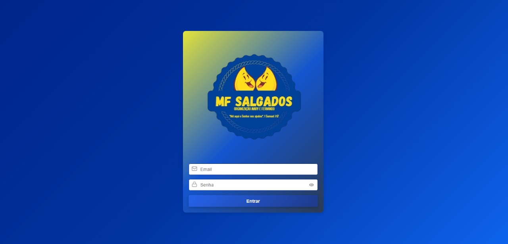
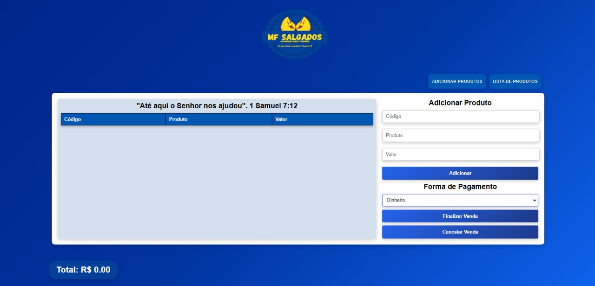
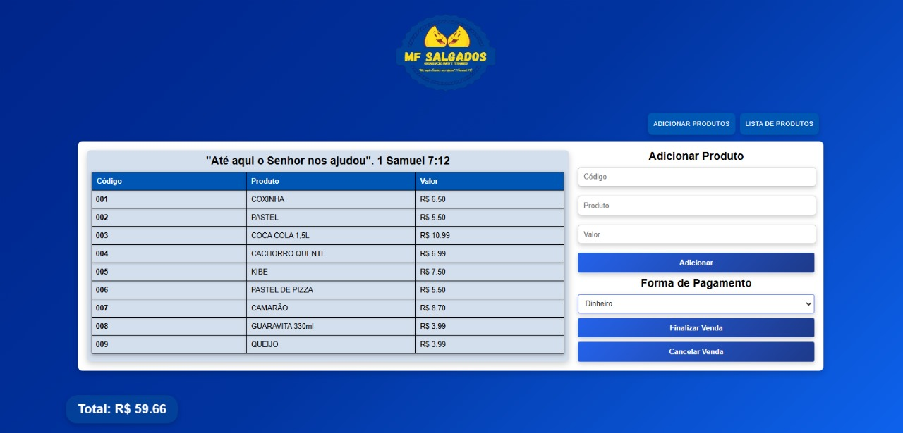
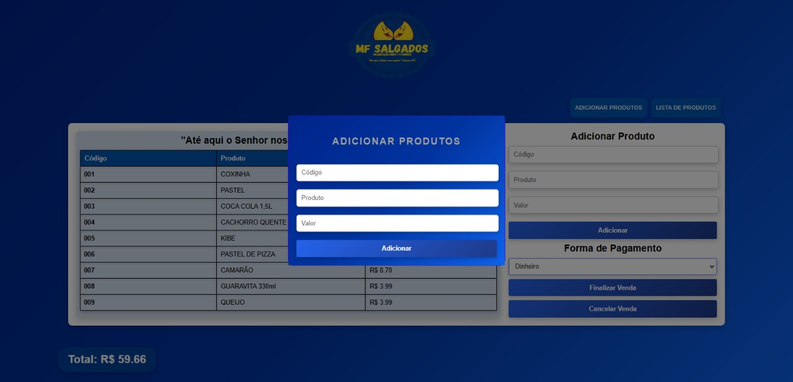
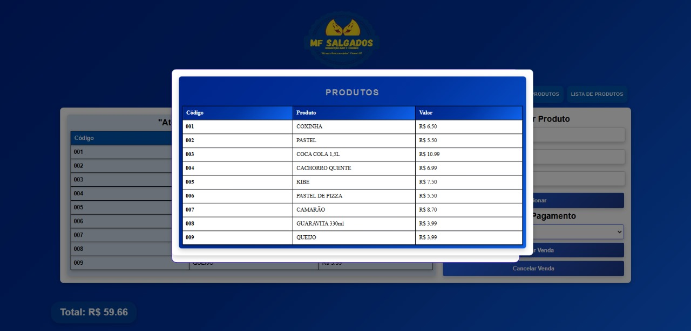

<h1 align="center"> MF SALGADOS </h1>

Este projeto foi desenvolvido para uma empresa especializada na venda de salgados
e bebidas, oferecendo um sistema de PDV eficiente e intuitivo. Criado para otimizar
o atendimento ao cliente em suas demandas diárias, o sistema proporciona uma experiência
simples e ágil, facilitando as operações e garantindo mais praticidade para o usuário.

  <a href="#-tecnologias">Tecnologias</a>&nbsp;&nbsp;&nbsp;|&nbsp;&nbsp;&nbsp;
  <a href="#-projeto">Projeto</a>&nbsp;&nbsp;&nbsp;|&nbsp;&nbsp;&nbsp;
  <a href="#-layout">Layout</a>&nbsp;&nbsp;&nbsp;|&nbsp;&nbsp;&nbsp;

 

  

  

  

  

  

## 🚀 Tecnologias

Este projeto foi desenvolvido utilizando as seguintes tecnologias, bibliotecas e etc:

- React e CSS
- JavaScript
- Git e Github
- React Router
- React Modal Component (Material UI)

## 💻 Projeto

Ágil e eficiente, o sistema foi desenvolvido para aprimorar a rotina do usuário,
proporcionando uma gestão mais prática e organizada.

---

by RoneyAlmeida :wave:
